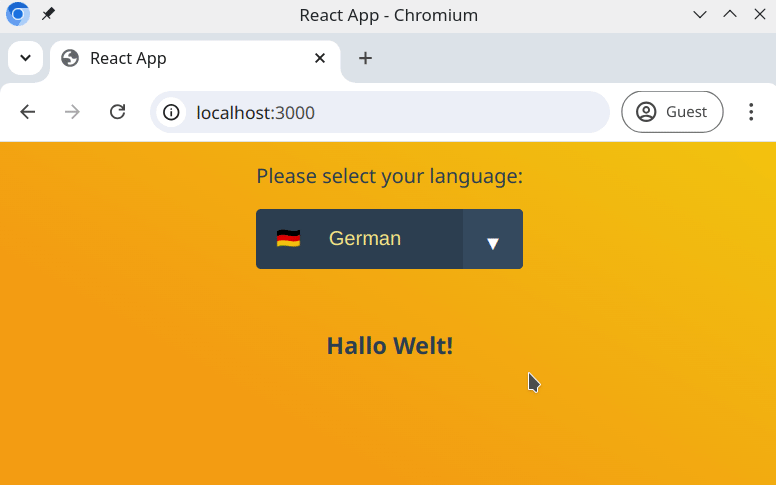

# Using the useContext Hook for Application Language  (React)

This project demonstrates how to use the `useContext` React hook to manage the application's language state. Users can select a language from a dropdown menu, and the app will display content in the chosen language.

## Components

  - **Header**
    - `LanguageChooser`: Displays a dropdown for selecting languages.
  - **Content**
    - `WelcomeMessage`: Shows a greeting in the selected language.

## Features

- **Dynamic Language Selection:**  
  Users can choose between languages (e.g., English, German, etc.).
  
- **Localized Greetings:**  
  Example:
  - German: `"Hallo Welt!"`
  - English: `"Hello World!"`


- **Global State Management:**  
  Language selection in `LanguageChooser` updates the greeting in `WelcomeMessage` using `useContext`.


## Preview
Here’s a preview of the expected behavior:



## How to Run the Project

To run this project locally on your computer, follow these steps:

## Getting Started
1. Clone the repository to your local machine:
  ```bash
   git clone <repository-url>
  ```
  2. Navigate to the project folder
  ```bash
   cd <directory-name>
  ```
  3. Install dependencies
  ```bash
   npm install
  ```
  4. Start the development server
   ```bash
   npm start
  ```
  
